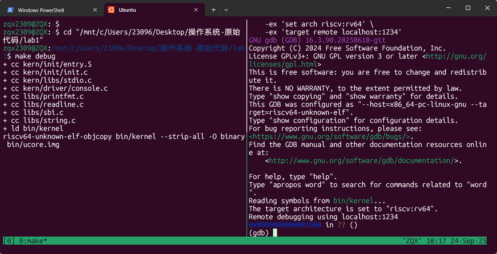

# <center> 操作系统实验报告</center>
## <center>2313411 张启鑫</center>
### 练习一
 阅读 kern/init/entry.S内容代码，结合操作系统内核启动流程，说明指令 la sp, bootstacktop 完成了什么操作，目的是什么？ tail kern_init 完成了什么操作，目的是什么？
代码内容如下：
```
#include <mmu.h>
#include <memlayout.h>

    .section .text,"ax",%progbits
    .globl kern_entry
kern_entry:
    la sp, bootstacktop

    tail kern_init

.section .data
    # .align 2^12
    .align PGSHIFT
    .global bootstack
bootstack:
    .space KSTACKSIZE
    .global bootstacktop
bootstacktop:
```
(1)la sp, bootstacktop
作用：将上一步声明的符号bootstacktop的内存地址传给寄存器sp
目的：设置了内核启动时的栈顶位置，为内核启动后保存函数调用，局部变量等信息提供专门的栈空间。通过将 sp 指向 bootstacktop，为后续 C 语言内核初始化代码（如 kern_init）提供了正确的栈环境，保证函数调用和局部变量的正常工作。
(2)tail kern_init 
作用：跳转到kern_init函数进行执行并且不会再返回调用函数
目的：直接进入内核初始化主流程。tail 指令会释放当前函数的栈帧，跳转到 kern_init，让内核初始化代码开始执行。这样做可以节省栈空间，并且在内核启动后不会再返回到 entry.S，保证内核初始化流程的唯一性和简洁性。
### 练习二
为了熟悉使用 QEMU 和 GDB 的调试方法，请使用 GDB 跟踪 QEMU 模拟的 RISC-V 从加电开始，直到执行内核第一条指令（跳转到 0x80200000）的整个过程。通过调试，请思考并回答：RISC-V 硬件加电后最初执行的几条指令位于什么地址？它们主要完成了哪些功能？
#### 调试过程
首先打开Ubutun，执行 sudo apt install tmux 指令来下载tmux 

接着通过Ctrl+B，并按下%键进入双窗口模式。在左边窗口通过cd命令定位到lab1目录后输入 make debug 指令，这一步操作的目的是启动qemu并且等待GDB的连接



可以看到，此时右边窗口中出现了这样的内容：0x0000000000001000 in ?? ()
这说明程序此时停在了地址 0x1000 处，这是 QEMU模拟的 RISC-V 硬件加电后的起始执行点。
接着执行 (gdb) b* kern_entry 命令对 kern_entry函数下断点，使程序等会在入口函数的第一条指令前停止，便于我们检查寄存器状态或反汇编附近的代码。随后执行 （gdb）c 开始执行程序至内核第一条指令。

接下来，我们输入 (gdb) x/10i 0x80200000 ，观察反汇编内核入口处的指令

并输入 (gdb) info registers 检查寄存器状态

以上便是第一次实验的调试过程
#### 问题解答
从刚刚的调试过程不难看出，RISC-V 硬件加电后最初执行的几条指令就位于 0x1000 地址处，我们输入 (gdb) x/10i 0x1000 跟踪0x1000处的几条指令，结果如下图：

我们对这些指令一一进行分析
第一条指令 auipc 的作用是计算相对地址，将当前 PC 值的高 20 位与立即数 0 左移 12 位后相加，结果存入 t0 寄存器，实际上就是让 t0 获得当前指令地址 0x1000，为后续访问内存中的数据做准备。
addi 指令是加立即数指令，他将 t0 寄存器中的地址值加上立即数 32，并将结果存入 a1 寄存器，即计算得到地址 0x1020 。
csrr 指令的作用是读取线程 ID 寄存器 mhartid ，将当前执行核的编号存入 a0 寄存器，在多核系统中用于识别当前是哪个核心在执行，a0 作为参数寄存器传递核ID 。
取址指令 ld 从地址 0x1018 加载数据到 t0 寄存器，这里加载的是下一阶段引导程序的入口地址。
跳转指令 jr 跳转到 t0 寄存器中存储的地址执行，完成从初始固件到 OpenSBI 的控制权转移
剩下的 unimp 和 .insn 指令作为数据区的填充和占位